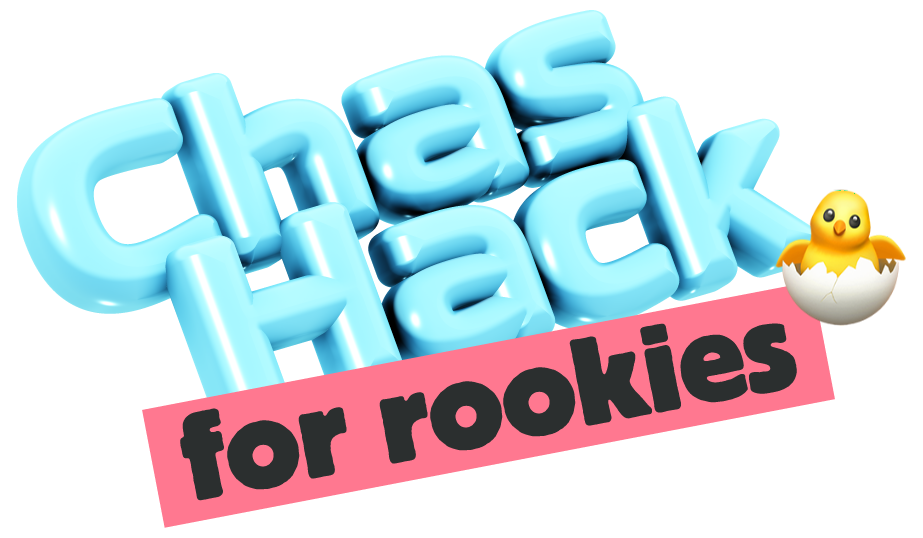

# ChasHack: uppgiftssidan

<p align="center"></p>

Bygg-repo för uppgiftsteamet (Anton, Victoria, Theo) inför ChasHack på Chas
Academy, fredag 11 september 2026. Här finns bara det trion bygger: sidan,
planen, design-assets och skelettet. Planeringsunderlag och möten ligger i det
interna arkiv-repot, inte här.

## Temat

Deltagarna bygger en **lagsida** i sitt eget repo, från tre tomma filer
(`index.html`, `style.css`, `script.js`) till en publicerad webbplats om laget.

- **Huvudspåret** - tolv obligatoriska steg, lätt till medel, i ordning. Slutar
  i en färdig sida på GitHub Pages. 145p.
- **Side quests** - sexton frivilliga extrauppdrag, medel till riktigt svår, som
  plockas längs vägen och bygger vidare på samma sida. 400p.

Poängen avgör placeringen, men **alla tolv steg i huvudspåret måste vara
godkända för att ett lag ska kunna vinna**. Topplistan märker lag som inte är
klara med "Ej kvalificerad" och sorterar dem under de kvalificerade.

Uppgifterna bor i `uppgiftssida.html`, i arrayerna `MAIN` och `QUESTS`.
`uppgifter.md` är teamets arbetslista över samma innehåll.

## Innehåll

- `uppgiftssida.html` - deltagarsidan: huvudspåret som en stig med framstegsmätare,
  side quests i ett filtrerbart rutnät, inlämning av repo-länk, granskningsflöde,
  topplista med kvalificeringsregel och väggläge (`?wall=1`). Kör helt lokalt i
  webbläsaren (localStorage), inget skickas någonstans. Det här är filen som
  publiceras till GitHub Pages.
- `uppgifter.md` - arbetslistan för uppgiftsteamet. Samma uppgifter i markdown,
  lätt att redigera på GitHub.
- `plan-ny-uppgiftssida.html` - plan v3: designriktning, granskningsflöde,
  tidsplan och öppna frågor. Granska i webbläsaren.
- `sources/assets/` - ChasHack-bannrarna och logotypen som designen bygger på.
- `starter/` - utkastet som det publika skelett-repot byggdes på
  (github.com/AntonSatt/chashack-starter).
- `.github/workflows/deploy-pages.yml` - publicerar `uppgiftssida.html` som
  `index.html` på GitHub Pages vid push till `main`.

## Kör lokalt

Öppna `uppgiftssida.html` direkt i webbläsaren - den fungerar utan server.

Vill ni ändå köra den över http (till exempel för att testa exakt som på Pages):

```bash
npx --yes serve .
```

## Status och nästa steg

- Uppgifterna är omgjorda till lagsidetemat: huvudspår plus side quests.
  De gamla kategoriuppgifterna och `.NET`-spåret är borttagna, men finns kvar
  i git-historiken om något ska återanvändas.
- Kontrollera att `index.html`, `style.css` och `script.js` ligger tomma i
  start-repot innan dagen.
- Serverversion med delad state (riktig granskningskö och leaderboard) byggs
  när uppgifterna är spikade. Just nu ligger allt i localStorage, och
  granskningen godkänns lokalt i demoläget.
